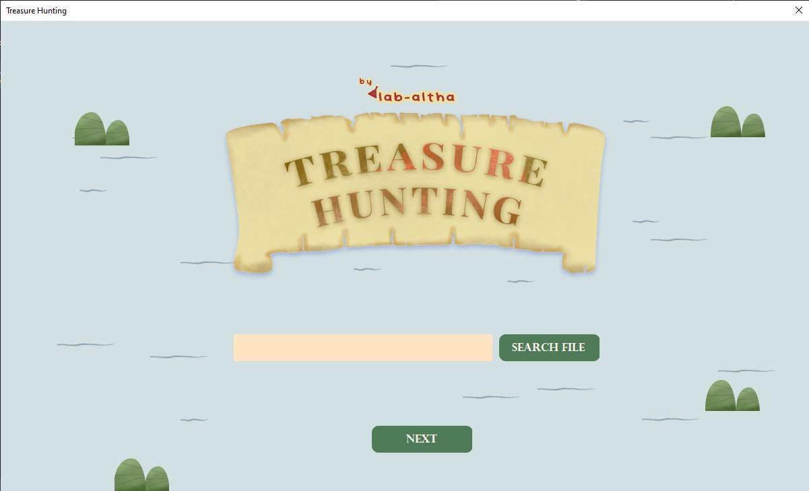
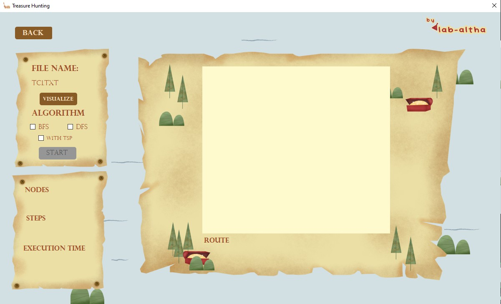
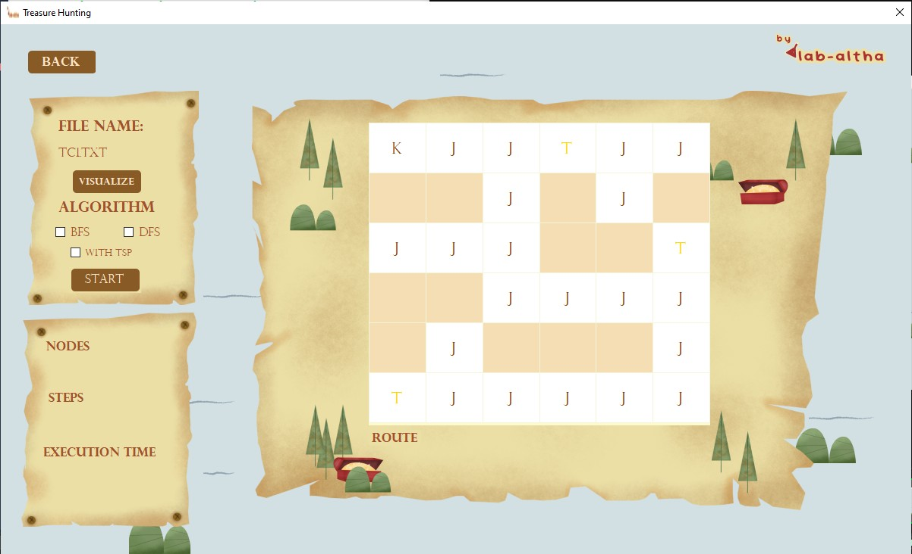

This task is done to fulfill Strategy and Algorythm IF2211

# Introduction
This application will help you find all the treasure with BFS and DFS algorithm! You can also use the TSP toggle to find your way back~~





# Dependencies
Make sure you have this
```
1. Visual Studio
2. .NET SDK `ver 6` or above
```
# How To Run
1. Open Visual Studio
2. Clone this github
3. Click lab-altha.sln
4. Click the run button above or use `F5 or Fn + F5`

| Author | NIM  | Nama |
| ------------- | ------------- |
| 13521130 | Althaaf Khasyi Atisomya  |
| 13521132  | Dhanika Novlisariyanti |
| 13521156 | Brigita Tri Carolina |

